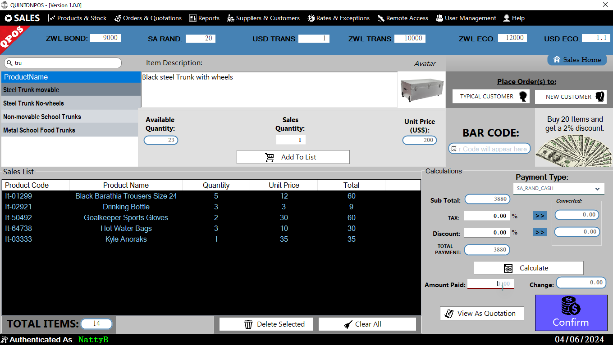
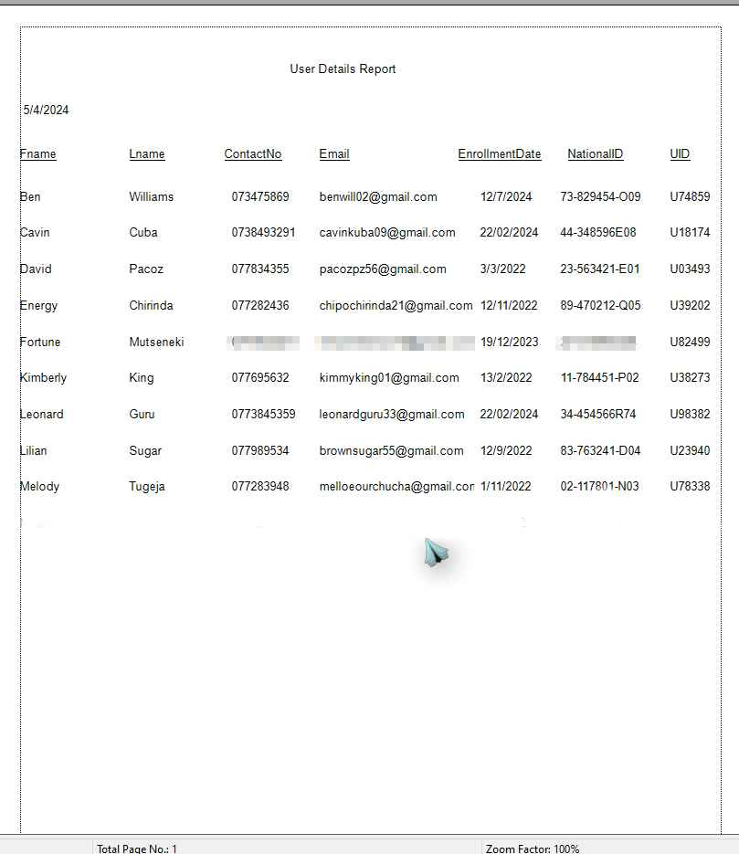
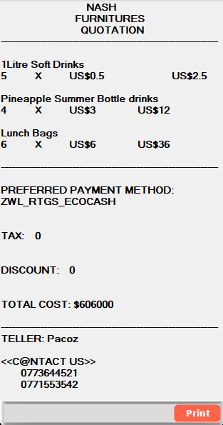

# Quinton-POS

## Quinton Point Of Sale (QPOS) is a Point Of Sale project designed for use in general stock management systems.

# It's amazing features include:
* Monitoring Stock Levels and notifying the user when stock quantities are getting low
* Supports multi-currency
* Supports products descriptive images   
* Supports creating organised reports   
* Supports creating quotations   
* Supports application background auto startup on user login to check for low stock quantities

## You can test the pre-release version

## TEST-MODE PRO TIP:
* Program requires .Net Framework 4.7.2
* Database Type: Access database
* Login credentials (zip) are attached to the pre-release

# Happy coding...
